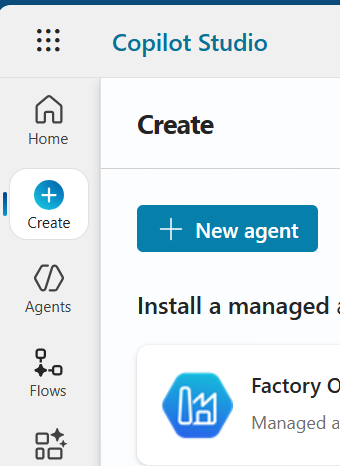
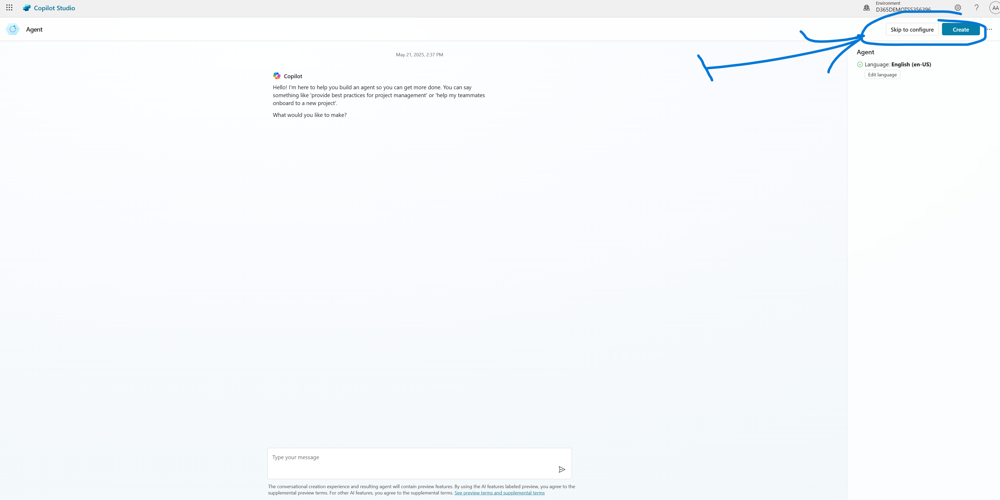
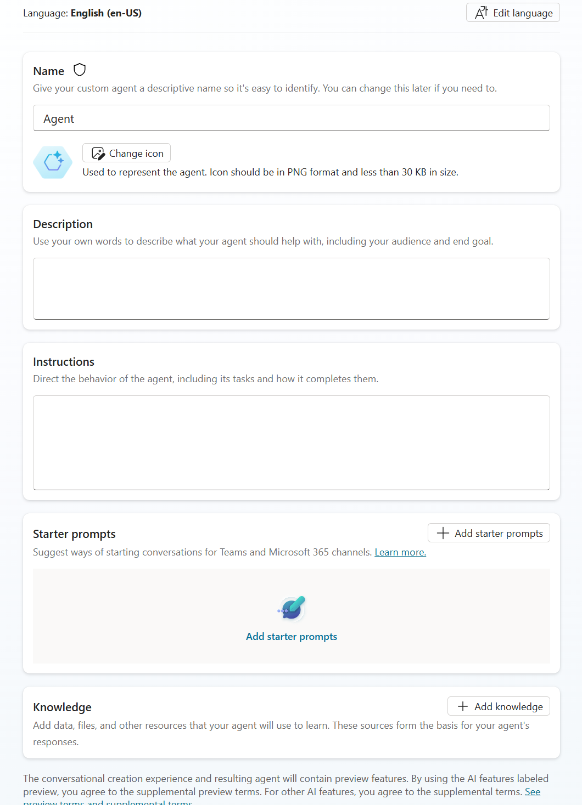
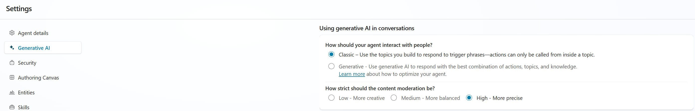

# Lab 01: Microsoft Copilot Studio - Erstellen eines Agents

## Übersicht
In diesem Lab werden ein Agent in Copilot Studio erstellt und die grundlegenden Konzepte geklärt.

## Voraussetzungen
- Copilot Studio Zugang

## Lab-Umgebung einrichten
1. Navigieren sie zu [https://copilotstudio.microsoft.com](https://copilotstudio.microsoft.com)
2. Stellen sie sicher dass die richtige Umgebung ausgewählt ist (rechts oben unter "Umgebung" oder "Environment")

## Übung 1: Erstellung des Helpdesk Agents
Zeit: 30 min
### Ziel
- Teilnehmer kennen die Grundlagen der Agent Erstellung und dessen Optionen. Die Optionen zur Automatischen Erstellung werden übersprungen um sie Hands-On kennen zu lernen.

### Schritte
1. Starten sie die Erstellung eines neuen Agents mittels *Create > + New Agent*, siehe Abbilung 1

    

2. Überspringen sie die Copilot Ansicht mittels *Skip to Configure* rechts oben

    

3. In der folgenden Ansicht, vergeben sie lediglich einen Namen für den Agent und klicken sie auf *Create* rechts oben. **Lassen sie alle weiteren Felder leer, diese Wert werden in den folgenden Labs konfiguriert.**

    

4. Klicken sie auf *Settings* rechts oben um den Orchestrator von *Generative* auf *Classic* umzustellen.

    

5. Im selben Einstellungsbereich unter *Security* passen sie die Authentifizierungsoptionen so an, dass eine Verwendung anonym möglich ist.

6. Passen sie das Willkommens Thema an und auch das *Conversation Start*, sodass ein Benutzer weiss was er/sie mit dem Agent erreichen kann.

### Ergebnisse
- Ein grundlegender interaktiver (Chat) Agent ist verfügbar. Der Agent nutzt *Classic Orchestration* um eingehende Anfragen mittels Intent Erkennung auf Themen aufzuteilen.
- Das bestehende Systemthema zeigt eine angepasste Willkommensnachricht an.

## Weiterführende Links
- [Copilot Studio Orchestration Modes](https://learn.microsoft.com/en-us/microsoft-copilot-studio/advanced-generative-actions)
- [Copilot Studio System Topics](https://learn.microsoft.com/en-us/microsoft-copilot-studio/authoring-system-topics?tabs=webApp)
