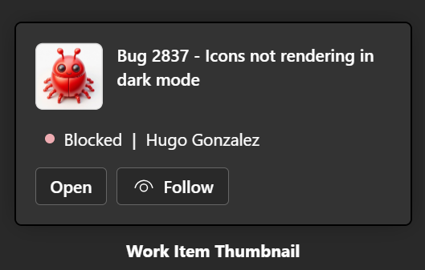
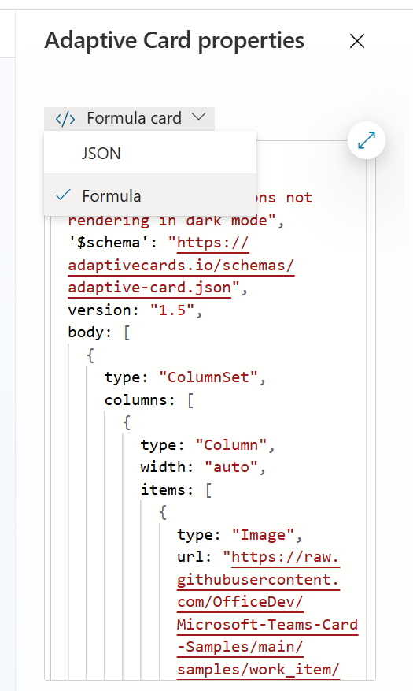

# Lab MCS.2.2: Erweiterte Optionen mit Adaptive Cards

## Übersicht
Dieses Lab liefert eine Einführung in erweiterte Optionen zur Gestaltung von Antworten bzw. Nutzererlebnissen.

## Voraussetzungen
- Copilot Studio Zugang
- Kenntnisse im Umgang mit Topics, Triggers und Themen

## Lab-Umgebung einrichten
1. Navigieren sie zu [https://copilotstudio.microsoft.com](https://copilotstudio.microsoft.com)
2. Stellen sie sicher dass die richtige Umgebung ausgewählt ist (rechts oben unter "Umgebung" oder "Environment")
3. Öffnen sie den *Helpdesk Agent*, welchen sie in Lab MCS.1.1 erstellt haben. Sie finden die Anleitung dazu in der Datei [Lab MCS.1.1](Lab%20MCS.1.1%20-%20Create%20an%20agent.md)
4. 

## Übung 1: Erstellung einer grafischen Oberfläche im Chat
Zeit: 15 min
### Ziele
- Teilnehmer kennen die Möglichkeiten, welche Adaptive Cards bieten um Basic Cards und "voll" Adaptive Cards zu erstellen.

### Gewünschte Ergebnisse
-  Der Helpdesk Agent soll Benutzern nicht nur textuell sondern auch grafisch aufbereitet antworten und eine "Mini UI" präsentieren zur Geräteauswahl.

### Schritte

**1. Erweiterung des Ticket Dialoges mit Variations und Basic Cards**

- Um die Interaktion mit Abwechslung zu gestalten fügen sie Variation in ihre Antwortnachrichten ein
- Fügen sie zudem im Dialog *Ticket Erstellung* eine Basic Card eim, welche dem Nutzer die Wahl einer Service Kategorie bietet.

**2. Erweiterung des Hardware Refresh Dialog mit eigenen Adaptive Cards**

    - Öffnen sie das bestehende Topic "Hardware refresh"
    
    - Der Agent soll nach Eingabe einer Seriennummer mit einer Adaptive Card anworten, mit folgenden Inhalten
        - Symbolbild des Gerätes (sie können folgende URL als Beispiel für das Bild verwenden: )
        - Text: Beispiel: Ihr  <**Gewählte Kategorie**> mit der Seriennummer <**Eingegebene Seriennr.**> ist am 01.05.2026 zum Hardware Refresh berechtigt.
        - Ebenso sollen Buttons für
            - Soforttausch
            - Gerät defekt
        - als Optionen geboten werden

        - Verwenden sie die Starter Vorlage *Work Item Thumbnail* aus dem [Adaptive Card Designer](https://adaptivecards.microsoft.com/designer.html)
        
        
    - Nun sollen Werte aus Variable in die Adaptive Card eingefügt werden. Stellen sie dazu direkt im Designer von 'JSON' auf 'Formula' um.
    
         Nun können direkt in dem JSON die Variablen mit ihrem vollen Namen eingefügt werden. (Beispiel: Topic.Seriennummer)

### Ergebnisse
- Der Helpdesk Agent wurde um neue UI Funktionen ergänzt mittels Adaptive Cards

## Weiterführende Links
- [Adaptive Card Designer](https://adaptivecards.microsoft.com/designer.html)
