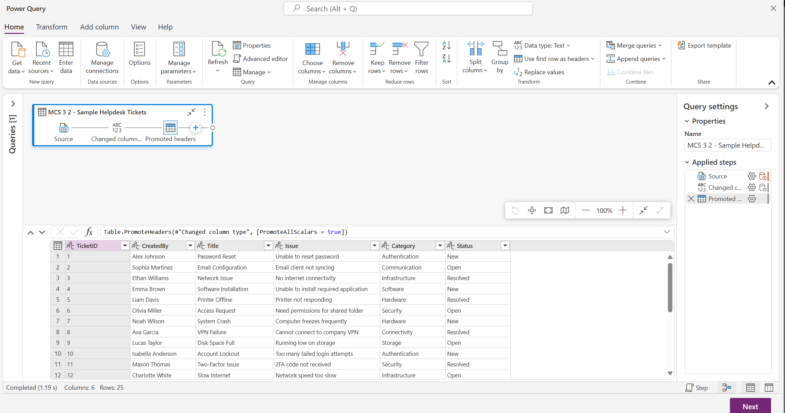
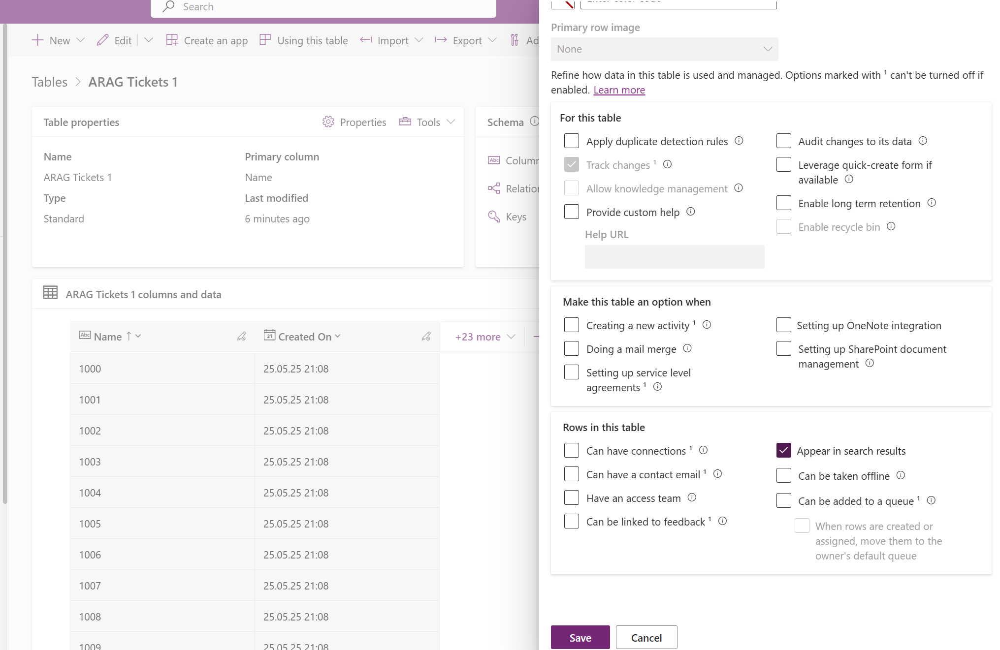

# Lab MCS.3.2: Generative Orchestration - Wissensquellen

## Übersicht
In diesem Lab werden die Vorteile der Wissenqeullen der *Generative Orchestration* erkundet.

## Voraussetzungen
- Copilot Studio Zugang
- Kenntnisse im Umgang Classic Orchestration und Generative Orcehstration

## Lab-Umgebung einrichten
1. Navigieren sie zu [https://copilotstudio.microsoft.com](https://copilotstudio.microsoft.com)
2. Stellen sie sicher dass die richtige Umgebung ausgewählt ist (rechts oben unter "Umgebung" oder "Environment")
3. Öffnen sie den Agent welchen sie in [Lab MCS.3.1](Lab%20MCS.3.1%20-%20Generative%20Orchestration.md) erstellt haben

## Übung 1: Dem Helpdesk Agent Wissen hinzufügen
Zeit: 15 min
### Ziele
- Der neue generative Helpdesk Agent soll nun sein Wissen nun aus mehreren Quellen (Dokumenten) und Systemen (Schnittstellen) beziehen.

### Gewünschte Ergebnisse
-  Der Helpdesk Agent kann mit Wissen aus statischen Dokumenten und aus Datenbanken antworten.

### Schritte

**1. Agent Knowledge**

- Fügen sie dem Agent die Ticketdatenbank als Wissenquelle hinzu
- Unter [make.powerapps.com](https://make.powerapps.com) navigieren sie zu *Tables* / *Tabellen*
- Klicken sie oben im Menü auf *Import > Test / CSV* und verwenden sie die Beispielticketdaten als URL
[https://raw.githubusercontent.com/aschauera/training/refs/heads/master/MCS%20-%20Microsoft%20Copilot%20Studio/labs/data/MCS.3.2%20-%20Sample%20Helpdesk%20Tickets.csv](https://raw.githubusercontent.com/aschauera/training/refs/heads/master/MCS%20-%20Microsoft%20Copilot%20Studio/labs/data/MCS.3.2%20-%20Sample%20Helpdesk%20Tickets.csv)

- Stellen sie den Importassistenten fertig, sodass ein Dataverse Tabelle mit den Ticketdaten erstellt wird.
- Hinweis: Verwenden sie den Schritt "Use first row as headers" damit die erste Zeile als Spaltenüberschriften erkannt werden

- Diese neue Tabelle soll nun als Grundlage verwendet werden, um Antworten zu Tickets zu ermöglichen.

- Sobald die Tabelle erstellt ist  (Den Status sehen sie unter dem Menüpunkt *Dataflows*), fügen sie diese als Wissensquelle in ihre Agent ein.
- Sollte die neue Tabelle nicht erscheinen, navigieren sie zur Tabelle und stellen sie sicher, dass die Option zur Suche gesetzt ist.

- Fügen sie dann zusätzlich das [IT Helpdesk Wissensdokument](../labs/data/M03%20GenAnswers%20-%20HelpDesk%20KB%20Document.pdf) hinzu mittels *Upload*

- Testen sie ihren Agent. 
- Ihr Agent sollte nun in der Lage sein mittels den Instruktionen und dem Wissen Fragen über Tickets und auch Fragen zu Wissensartikeln zu beantworten.

### Ergebnisse
- Der Helpdesk Agent kann nun Antworten zu aktuellen Helpdesk Tickets und auch Wissensartikeln beantworten.

## Weiterführende Links
